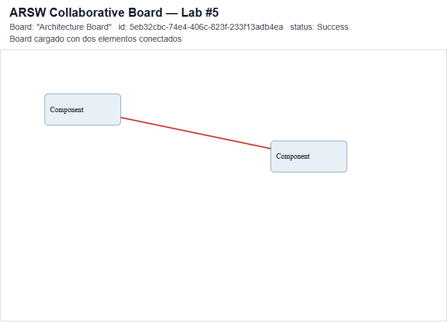
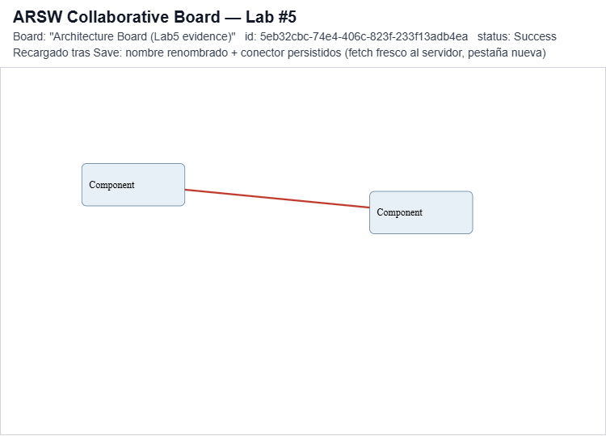

# ADR-002 — Client boundaries

## Context

El Lab #5 agrega un cliente web sobre el backend ya existente del Lab #4.
Sin límites claros, es fácil que el código de red, el estado del board y
el dibujo en pantalla terminen mezclados en un mismo archivo, lo que
dificultaría agregar WebSockets en el Lab #6 sin reescribir todo el
cliente.

## Decision

El cliente se divide en 4 módulos con responsabilidades separadas:

- BoardApiClient: concentra todas las llamadas fetch al backend.
- BoardState: guarda el board actual, la selección, el modo de
  interacción (idle/connecting) y el estado de la operación remota
  (loading/success/error).
- BoardView: dibuja el board como SVG y captura los eventos del mouse.
- BoardApp: orquesta a los otros tres, decidiendo cuándo llamar a la API
  y cuándo volver a renderizar.

BoardState no depende de BoardApiClient ni de BoardView, así que puede
probarse y modificarse sin necesitar el navegador ni el backend.

## Consequences
Positivas

- Todo el acceso HTTP vive en BoardApiClient. Sus fallos se traducen a un BoardApiError con status, code y message, así que ni BoardApp ni BoardView conocen excepciones Java ni detalles de fetch.

- BoardState es la fuente de verdad y BoardView solo proyecta un snapshot a SVG. Se puede cambiar cómo se dibuja sin tocar las reglas del Board, y al revés.

- BoardState no depende de red ni de DOM, por lo que sus reglas (por ejemplo, las del CONNECTOR) pueden probarse sin navegador ni backend.

- El backend no cambia por culpa de la interfaz: la persistencia sigue siendo el contrato POST/GET/PUT del Board, sin endpoints como /moveElement.

- Para el Lab #6, un canal WebSocket puede entrar como una nueva fuente de cambios que actualiza BoardState desde BoardApp, sin reescribir la vista ni el cliente REST.

- El guardado es una acción explícita (Save), por lo que arrastrar un elemento no genera tráfico de red.

Negativas / costos

- BoardApp concentra la orquestación (operaciones remotas, retry, bloqueo de controles). Si el cliente crece, hay que vigilar que no se vuelva el nuevo monolito.

- snapshot() usa structuredClone, que no admite funciones. Por eso el estado remoto guarda solo datos planos (nombre de la operación y un error simple) y la operación a reintentar vive en BoardApp. Es una restricción que quien modifique el estado debe respetar.

- Cada cambio vuelve a dibujar todo el SVG. Es simple y suficiente para un Board pequeño, pero no escala a cientos de elementos.

- Guardar reemplaza el Board completo (PUT): si dos personas editan a la vez, gana la última escritura. Esto es aceptable ahora y es exactamente lo que el Lab #6 deberá resolver.

- No hay pruebas automáticas del cliente en esta fase; se verifican manualmente.

## Trade-off
Se priorizó claridad y desacoplamiento sobre eficiencia y sofisticación.

| Decisión tomada | Alternativa descartada | Qué se gana | Qué se paga |
| --- | --- | --- | --- |
| 4 módulos ES con funciones fábrica | Un solo `app.js` con todo | Responsabilidades claras, base para WebSocket | Más archivos y más cableado en `BoardApp` |
| JavaScript + SVG sin framework | React / Vue / Angular | Foco en la arquitectura, sin dependencias ni build | Render manual y más código de eventos |
| Render completo en cada cambio | Diff / actualización parcial del DOM | Vista simple, siempre coherente con el estado | Costo proporcional al número de elementos |
| Save explícito con PUT del Board completo | Autosave o endpoints por acción | Sin tráfico durante el arrastre; contrato del Lab #4 intacto | El usuario puede perder cambios si olvida guardar |
| Retry en `BoardApp` con la operación completa | Guardar la función dentro de `BoardState` | Estado serializable y retry que reaplica el resultado | La lógica de reintento queda fuera del estado |

Se aceptó pagar en rendimiento y en comodidad de uso porque el objetivo de este laboratorio es una estructura comprensible y lista para evolucionar, no un editor optimizado.
## Evidence

*Board cargado con dos elementos y un conector entre ellos.*

*Tras renombrar el board y guardar, se recarga la pagina desde cero y se vuelve a cargar por id: el nombre y el conector siguen ahi, confirmando que el PUT persiste en el backend.*

