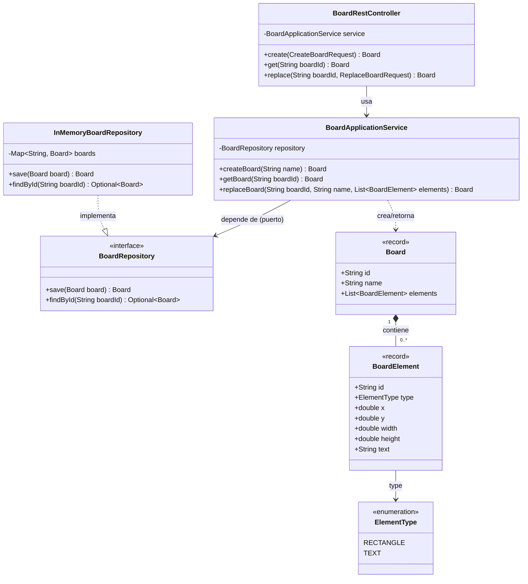

# Architecture Evidence — Lab 04

1. **ArchiMate Application View** — ver `archimate-application-view.png` (imagen) y `lab4-application-view.archimate` (modelo editable, hecho en Archi), en esta misma carpeta.
   - REST interface
   - Board application service
   - repository port / persistence adapter
   - board data / in-memory storage
   - clear relationships

2. **Class diagram**

Relaciones clave:

- `BoardRestController` usa `BoardApplicationService`, inyectado por constructor.
- `BoardApplicationService` depende solo del puerto `BoardRepository`, nunca de `InMemoryBoardRepository` directamente (ver `docs/ADR-001-repository-boundary.md`).
- `InMemoryBoardRepository` es la única implementación actual de `BoardRepository`.
- `Board` es inmutable y contiene entre 0 y N `BoardElement`.
- `BoardElement` referencia su `ElementType` (`RECTANGLE` o `TEXT`).

## Quality rule

The diagrams must describe the code that is actually delivered. Avoid decorative boxes and avoid generated diagrams containing every framework class.
